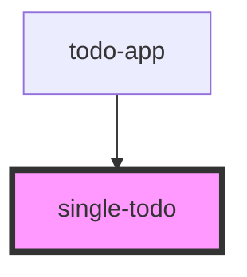

# single-todo

<!-- Auto Generated Below -->

## Properties

| Property | Attribute | Description | Type   | Default     |
| -------- | --------- | ----------- | ------ | ----------- |
| `todo`   | --        |             | `Todo` | `undefined` |

## Dependencies

### Used by

 - [todo-app](../todo-app)

### Graph

----------------------------------------------

*Built with [StencilJS](https://stenciljs.com/)*
