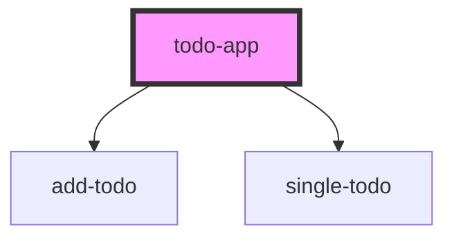

# todo-app

<!-- Auto Generated Below -->

## Properties

| Property | Attribute | Description | Type     | Default                                                                                                                                                                |
| -------- | --------- | ----------- | -------- | ---------------------------------------------------------------------------------------------------------------------------------------------------------------------- |
| `todos`  | --        |             | `Todo[]` | `[     { id: 1, title: "Learn Stencil", done: false },     { id: 2, title: "Learn Web Components", done: false },     { id: 1, title: "Learn React", done: true }   ]` |

## Dependencies

### Depends on

- [add-todo](../add-todo)
- [single-todo](../single-todo)

### Graph

----------------------------------------------

*Built with [StencilJS](https://stenciljs.com/)*
